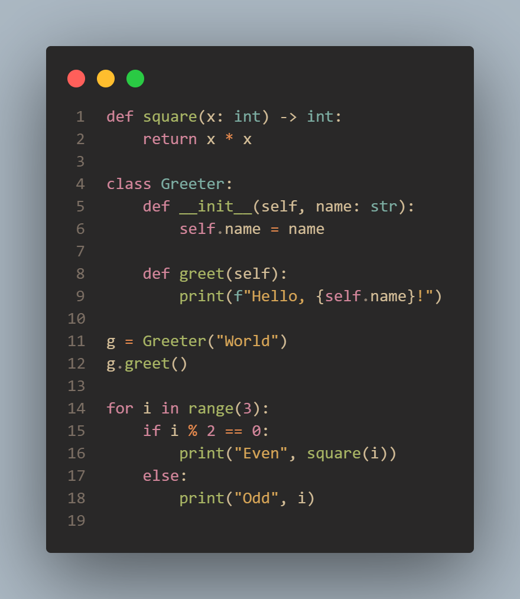
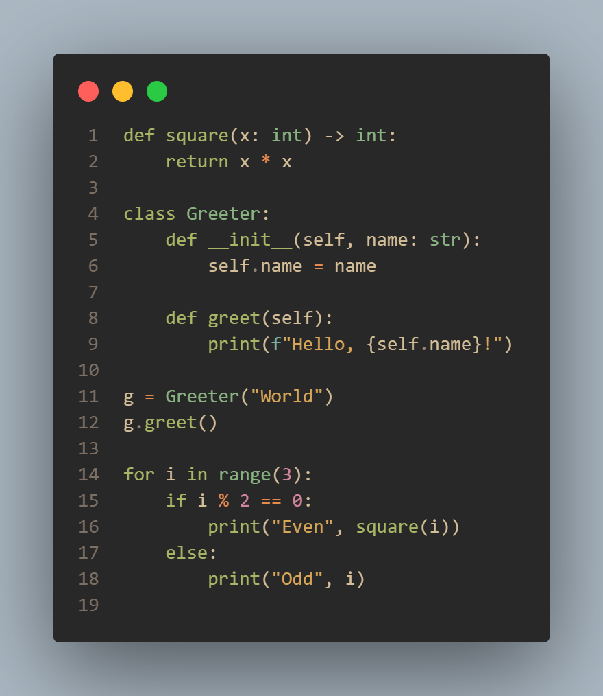
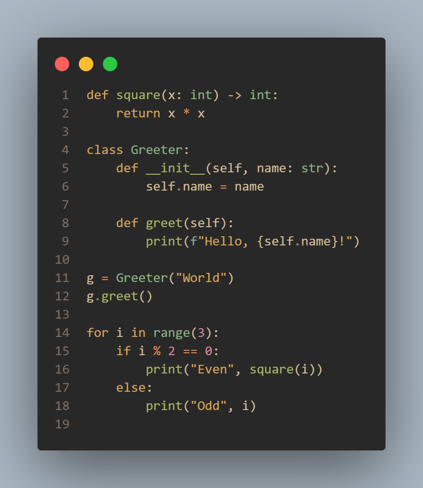
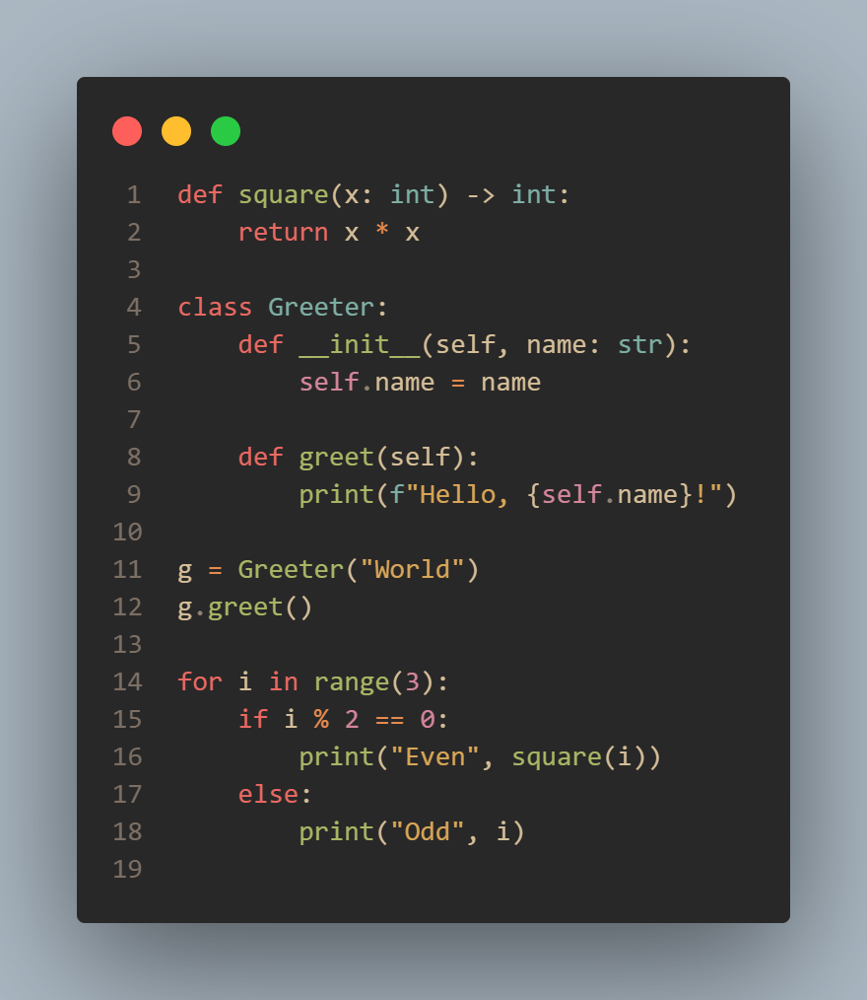

# Themes

Currently contains the following custom themes:
  ## 1. **Animal themes** (modified versions of [Gruvbox Material Dark](https://github.com/sainnhe/gruvbox-material-vscode.git))
   1. Bunny ([all previews](demonstrations/example-png/bunny)):

      *Dark night accompanied by fluffly pink*
   3. Hedgehog ([all previews]()):
     
      *Dark and cozy forest ground featuring green*
   3. Kangaroo ([all previews]()):

      *Dark night in the reddish-brown outback*
   5. Shark ([all previews](demonstrations/example-png/shark)):

      *Dark coral reef in deep sea for deep focus*

### Python
| Bunny | Hedgehog | Kangaroo | Shark |
|-------|----------|----------|-------|
|  |  |  |  |
     
  ## 2. **Monokai Dimmed New** (personalized version of Monokai Dimmed (provided by Microsoft))

&nbsp;

# Installation

### Prerequisites

You need to have [Visual Studio Code](https://code.visualstudio.com) installed.

### Windows

To download a local version of this theme vscode extension you need to follow these steps:

  1. Install vsce using `npm install -g vsce` in a terminal.

  2. Then, go to this project's directory and package the extension with `vsce package`. Enter `y` to bypass missing file errors. This should result in a `themes-1.0.0.vsix` in the project directory.

  3. You can now use `code --install-extension custom-vscode-themes-1.0.0.vsix` to add this extension to your local vscode.

  4. You can now set themes from this extension.

&nbsp;

**Enjoy!**
